# Authentication interaction model

Zaya has two deliberately separate authentication entry points. Both use the same identity service and JWT validation, but only a booking-triggered login creates or resumes booking context.

## State machine

```mermaid
stateDiagram-v2
  [*] --> Browsing
  Browsing --> BookingDraft: Book Now / Select service
  BookingDraft --> CustomerAuth: no session; persist draft in sessionStorage
  BookingDraft --> BookingForm: ROLE_CUSTOMER session
  BookingDraft --> RoleMismatch: ROLE_OWNER session
  CustomerAuth --> BookingForm: ROLE_CUSTOMER; hydrate draft
  CustomerAuth --> RoleMismatch: ROLE_OWNER
  RoleMismatch --> CustomerAuth: Switch account
  BookingForm --> Confirmation: slot selected and booking submitted
  Confirmation --> Browsing: clear booking draft

  Browsing --> UniversalAuth: header Log In
  UniversalAuth --> Browsing: ROLE_CUSTOMER; return route
  UniversalAuth --> CustomerBookings: ROLE_CUSTOMER; protected origin
  UniversalAuth --> OwnerDashboard: ROLE_OWNER
  UniversalAuth --> AdminLogin: Administrator login link
```



```text
onBookNow(selection):
  draft = { salonId, serviceId, staffId, date, time, forWhom }
  sessionStorage["salonmate_pending_booking"] = draft
  if no session: openAuthModal(trigger="booking", allowedRole="customer")
  else if token has ROLE_OWNER: showRoleMismatch()
  else: openBookingConfirmation(draft)

onHeaderLogin():
  openAuthModal(trigger="universal", returnRoute=currentRoute)
  // This action never creates a booking draft.

onAuthenticated(jwt):
  claims = verifyJwtOnServer(jwt)
  if ROLE_ADMIN: redirect("/admin/dashboard")
  pending = sessionStorage["salonmate_pending_booking"]
  if pending and ROLE_CUSTOMER: hydrate(pending); openBookingConfirmation()
  if pending and ROLE_OWNER: showRoleMismatch()
  else if ROLE_OWNER: redirect("/partner/dashboard")
  else if ROLE_CUSTOMER: returnToSavedRouteOr("/my-bookings")
  else: reject("Account has no supported role")
```

The demo decodes claims in the browser to demonstrate routing. Production must validate the signature, issuer, audience, expiry, and role claims on the server before creating an application session.

## Universal Login modal wireframe

```text
┌────────────────────────────────────────────┐
│ Universal login                         ×  │
│ Welcome back                              │
│ Choose the account type you want to access│
│                                            │
│ [ Sign in ] [ Create account ]             │
│ ┌────────────────┐ ┌────────────────────┐  │
│ │ Customer       │ │ Salon Owner        │  │
│ │ Book & offers  │ │ Manage your salon  │  │
│ └────────────────┘ └────────────────────┘  │
│                                            │
│ [ Continue with Google ]                   │
│ ───────────────── or ────────────────────  │
│ Email address                              │
│ Password                 Forgot password?  │
│ [ Sign in ]                                │
│                                            │
│          Administrator login →             │
└────────────────────────────────────────────┘
```

- **Customer tab:** returns to the public origin route; a protected origin falls back to My Bookings.
- **Salon Owner tab:** always routes to `/partner/dashboard` after authentication.
- **Administrator login:** is not a selectable public role and links to the restricted `/admin/login` route.
- **Contextual modal:** removes the role selector and admin link, labels the context “Customer booking,” and confirms that the draft is saved.
- On mobile the modal becomes a bottom sheet; on larger screens it is a centered dialog. It has a labelled close control, modal semantics, and a dimmed backdrop.

## JWT role routing contract

The frontend adapter accepts `roles: string[]` or a single `role` claim. Supported claims are `ROLE_CUSTOMER`, `ROLE_OWNER`, and `ROLE_ADMIN`; legacy `CUSTOMER`, `SALON_OWNER`, and `ADMIN` values are normalized during migration.

```js
function routeFromClaims(claims, pendingDraft, returnRoute) {
  const roles = new Set((claims.roles ?? [claims.role]).filter(Boolean));
  if (roles.has('ROLE_ADMIN')) return '/admin/dashboard';
  if (pendingDraft && roles.has('ROLE_CUSTOMER')) return '/booking/confirm';
  if (pendingDraft && roles.has('ROLE_OWNER')) return 'ROLE_MISMATCH';
  if (roles.has('ROLE_OWNER')) return '/partner/dashboard';
  if (roles.has('ROLE_CUSTOMER')) return returnRoute ?? '/my-bookings';
  throw new Error('Account has no supported role');
}
```

The booking draft is session-scoped and removed only after successful booking confirmation. This prevents a header login from manufacturing booking context while still allowing an active interrupted checkout to resume.
